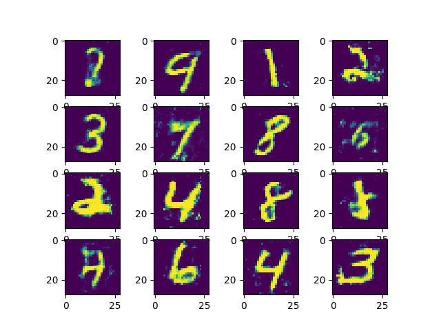

# MNIST-GANS
Generative Adversarial Networks on MNIST dataset using pytorch. This code is tested on python 3.7. For training tips and network architecture on GANs I took the help from [here](https://medium.com/ai-society/gans-from-scratch-1-a-deep-introduction-with-code-in-pytorch-and-tensorflow-cb03cdcdba0f) 

### Steps to run the project
* Download dataset using **download_dataset.sh**. Rest of the code assumes the dataset is present in **data** directory
> This downloads the dataset from the official site, unzips it and writes all the image files in the format counter-label.jpg
> With counter varying from 00000 to 60000 and label varying from 1 to 9
* Run training using **src/main.py**. You need to give a unique id to your run with option **--uid UNIQUE_ID**

###### Generated sample after 200 epochs

